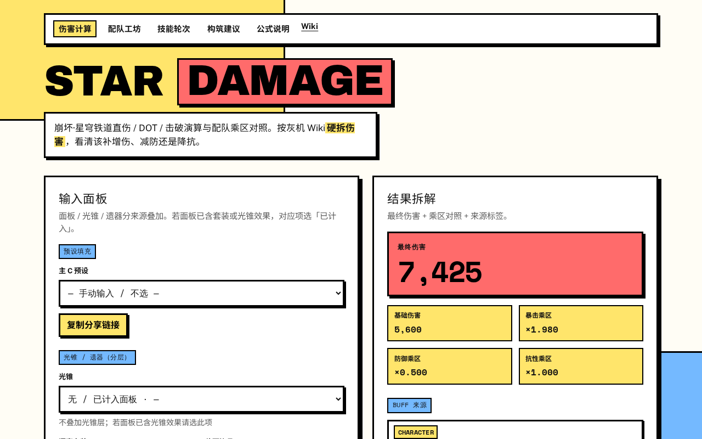

# star_damage_cal

崩坏·星穹铁道 **伤害计算 + 配队工坊 + 技能轮次 + 构筑建议**（Neo Brutalism UI）。

公式依据：[灰机 Wiki · 伤害计算公式](https://starrail.huijiwiki.com/wiki/%E4%BC%A4%E5%AE%B3%E8%AE%A1%E7%AE%97%E5%85%AC%E5%BC%8F)

线上：https://star.miawu.eu.cc/



## 功能

| 路由 | 用途 |
|------|------|
| `#/` | 直伤乘区拆解、边际收益、主 C / 光锥 / 遗器分层、来源标签、分享链接 |
| `#/team` | 辅助 Buff 汇总、弱点过滤、缺口诊断、单换优化、三人组合搜索、配队对比 |
| `#/rotation` | 普攻/战技/终结技/DOT/击破/超击破序列 → 一轮总伤与破韧时机 |
| `#/build` | 词条倾向（速度门槛优先）、Fribbels 面板 JSON、遗器扫描加算导入 |
| `#/formula` | Wiki 主干与常见误区 |

## 配队用法（简述）

1. 打开 `#/team`，选主 C 与敌人模板，勾选弱点（可选过滤同属性/植入辅）。
2. 排好三人辅，看乘区覆盖与缺口诊断。
3. 在候选池勾选角色 → 看「单人替换 Top」或「三人辅组合搜索」。
4. 把感兴趣的组合「加入对比」，对照伤害 / 乘区 / 破韧提示。

## 开发

```bash
npm install
npm run dev      # http://localhost:5173
npm test
npm run build
```

## 设计约束

[`docs/ui-neobrutalism.md`](docs/ui-neobrutalism.md) — 粗黑边、硬阴影、扁平高对比、禁止渐变。

路线图与验收见 [`TODO.md`](TODO.md)。
